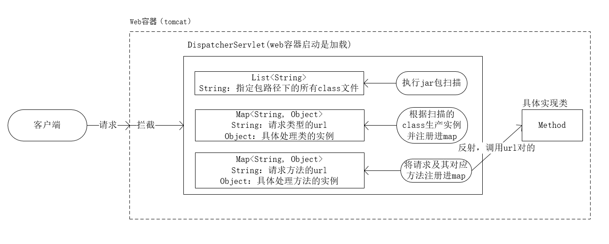
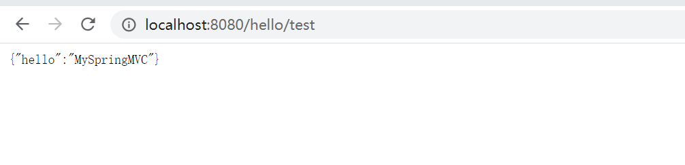

# MySpringMVC
This is a simple SpringMVC framework, and the project was set up to understand how SpringMVC works by hand-writing a simple SpringMVC implementation
## 背景
&nbsp;&nbsp;&nbsp;&nbsp;&nbsp;&nbsp;&nbsp;&nbsp;之所以想着去写一个简单的springmvc，其主要目的是为了能够更深入的去理解spring的容器思想，尽管我们的前辈们为我们精炼出了，你是怎么理解spring框架的？标准答案--IOC、AOP。但是经过这么多年对spring的使用，在我看来归根到底spring框架的核心思想还是“容器思想”。

&nbsp;&nbsp;&nbsp;&nbsp;&nbsp;&nbsp;&nbsp;&nbsp;就拿IOC控制反转来说（当然也有说DI的依赖注入），所谓控制反转即控制权限的反转，在使用spring框架之前我们在使用对象时都是哪里使用哪里new，我们就是上帝拥有对该对象的决定控制权，在使用spring框架之后我们可以将对象的实例化过程交给spring来处理，我们在使用某个对象时只需要从spring中取出该对象即可。这便是所谓的控制反转（IOC）。

&nbsp;&nbsp;&nbsp;&nbsp;&nbsp;&nbsp;&nbsp;&nbsp;而AOP面向切面编程又是什么意思呢？切面我们都知道，就是拿刀切过物体后留下的面，要面向他编程又是什么意思呢？简单说吧，如果我们把系统中的各个逻辑、各个组件都比喻成一个物体就好比一本书，这样我们的整个程序便成了一堆书，如果说我们现在想对这一堆书中的每一本书都插入一个书签，我们该怎么呢？翻开每一本书都进行书签的插入操作，这样也可以但是这样效率是不是太低了，而且与我们前提到的AOP面向切面编程一点关系都没有。怎么才能提高书签的插入效率呢？我们是不是可以把这一堆书规整的摞起来，然后准备与书本等量的书签利用某一工具面向书本的切面进行书签的一次插入。我想这便是面向切面编程的设计思想，联系到我们的实际编程例如：对于事物管理、日志处理，这些都是要在很多方法中经常操作的逻辑但他又与具体的业务逻辑没有太多的关系，例如对于数据库的修改，我们都要在执行修改前开启事物，在执行完数据库操作后进行事物提交，如果遇到异常了还要进行事物的回滚，但是这些操作本身有与业务逻辑没有太多关系，他就像一个书签一样更书本内容八竿子打不到一起。既然是这样，书签可以插入，我们这些开启事物提交事物的处理操作，是否能够像书签一样随用随插呢！答案是肯定，不就是要在业务代码执行前后完成一些特殊的操作嘛，我们Java的设计模式里面不是有模板方法模式吗，有那个不就可以了；我们Java当中还用动态代理、拦截器机器强大的反射机制。通过这些我们都能实现在业务方法执行前后完成一系特殊的操作，当然我们的spring中AOP是通过动态代理来实现的。叨叨了这么多，我想你对AOP应该也有了一定的认识，所谓AOP其实只是一种编程思想，他是我们对于事物管理类重复操作的最佳实践与解决方案。

&nbsp;&nbsp;&nbsp;&nbsp;&nbsp;&nbsp;&nbsp;&nbsp;好了废话实在是说的太多了，进入我们的主题了，轻量级的实现springmvc框架了，在开始撸代码之前，还是先提一个比较常见的面试问题：简单说一说springmvc的工作原理？

&nbsp;&nbsp;&nbsp;&nbsp;&nbsp;&nbsp;&nbsp;&nbsp;提到这个我想很多的人都会回答什么：处理器、映射器、视图解析器、前端控制器、这器那器的。反正就是网上随便一找就出来的近乎统一近乎标准的答案，但是看了这些完美的答案之后我们还是很难理解springmvc的工作原理到底是啥？所谓有图有真相，所以我在这里简单跟大家画一下我理解的springmvc工作原理的逻辑框图。



&nbsp;&nbsp;&nbsp;&nbsp;&nbsp;&nbsp;&nbsp;&nbsp;我相信通过上图你应该大致明白了，其实所谓：处理器、映射器、视图解析器、前端控制器、这器那器的都不重要，他的核心处理器就是DisPatcherServlet。对于客户端的所有请求都是通过最终都是由DisPatcherServlet来处理的，DisPatcherServlet在初始化的时候实现对象的初始化、完成url与对应对象及方法的映射，当接收到客户的请求后便从map中查找到url对于的对象及方法，通过反射执行该方法，以此完成对客户端请求的处理。

## 流程

1. 新建一个maven工程，引入servlet-api的依赖（因为springmvc本质上还是基于servlet工作的）。
2. 自定义MyAutowried（用于修饰依赖注入的变量）、MyController（用于修饰控制层）、MyQualifier（用于修饰依赖注入的变量）、MyRequestMapping（用于修饰路由映射，可以是类或者方法）、MyService（用于修饰服务层）。
3. 自定义核心处理器MyDisPatcherServlet，主要完成类的扫描加载、实例化、url映射、模型视图解析等工作。
4. 编写MyTestService、MyTestController类完成对自定义框架MySpringMVC的测试。

## 代码详情

### 注解类

1. MyAutowried

```java
/**
 * @AnnotationName MyAutowried
 * @Description 该注解主要用于修饰需要依赖注入的变量
 * @Author wuyuqing
 * @Date 2020/8/9 22:21
 * @Version 1.0
 */
@Target(ElementType.FIELD)
@Retention(RetentionPolicy.RUNTIME)
public @interface MyAutowried {
    String value() default "";
}
```

2. MyController

```java
/**
 * @AnnotationName MyController
 * @Description 用于修饰控制层类
 * @Author wuyuqing
 * @Date 2020/8/9 22:27
 * @Version 1.0
 */
@Target(ElementType.TYPE)
@Retention(RetentionPolicy.RUNTIME)
public @interface MyController {
    String value() default "";
}
```

3. MyQualifier

```java
/**
 * @AnnotationName MyQualifier
 * @Description 用于修饰依赖注入的变量
 * @Author wuyuqing
 * @Date 2020/8/9 22:29
 * @Version 1.0
 */
@Target(ElementType.FIELD)
@Retention(RetentionPolicy.RUNTIME)
public @interface MyQualifier {
    String value() default "";
}
```

4. MyRequestMapping

```java
/**
 * @AnnotationName MyRequestMapping
 * @Description 用于修饰路由地址映射
 * @Author wuyuqing
 * @Date 2020/8/9 22:30
 * @Version 1.0
 */
@Target({ElementType.METHOD, ElementType.TYPE})
@Retention(RetentionPolicy.RUNTIME)
public @interface MyRequestMapping {
    String value() default "";
}
```

5. MyService

```java
/**
 * @AnnotationName MyService
 * @Description 用于修饰服务层
 * @Author wuyuqing
 * @Date 2020/8/9 22:33
 * @Version 1.0
 */
@Target(ElementType.TYPE)
@Retention(RetentionPolicy.RUNTIME)
public @interface MyService {
    String value() default "";
}
```

### 核心处理类

1. MyDisPatcherServlet

```java
/**
 * @ClassName MyDisPatcherServlet
 * @Description TODO
 * @Author wuyuqing
 * @Date 2020/8/9 22:37
 * @Version 1.0
 */
public class MyDisPatcherServlet extends HttpServlet {
    /**
     * 存储扫描路径下所有的class文件
     */
    private ArrayList<String> clazzList = new ArrayList<>();

    /**
     * 存储所有的bean实例，key为请求名
     */
    private Map<String, Object> beanMap = new HashMap<>();

    /**
     * 存储路由地址与对应方法的映射，key为url
     */
    private Map<String, Object> requestMappingMap = new HashMap<>();

    @Override
    protected void doGet(HttpServletRequest req, HttpServletResponse resp) throws ServletException, IOException {
        doPost(req, resp);
    }

    @Override
    protected void doPost(HttpServletRequest req, HttpServletResponse resp) throws ServletException, IOException {
        /**
         * 处理请求的url
         */
        String requestURI = req.getRequestURI();
        String contextPath = req.getContextPath();
        String url = requestURI.replace(contextPath, "");
        /**
         * 获取url对应的方法
         */
        Method method = (Method) requestMappingMap.get(url);
        /**
         * 获取url对应的bean
         */
        Object bean = beanMap.get("/" + url.split("/")[1]);
        try {
            /**
             * 反射调用执行该方法
             */
            Object result = method.invoke(bean);
            /**
             * 视图解析
             */
            resp.getWriter().print(new Gson().toJson(result));
        } catch (IllegalAccessException e) {
            e.printStackTrace();
        } catch (InvocationTargetException e) {
            e.printStackTrace();
        }


//        System.out.println("hello myspringmvc");
//        resp.getWriter().print("hello myspringmvc");
//        super.doPost(req, resp);
    }

    @Override
    public void init() throws ServletException {
        /**
         * 扫描指定目录下的class文件
         */
        scanAllAnnotation("com.itxiaoyuaiit.learn");
        /**
         * 利用反射实例化bean
         */
        beanInit();

        /**
         * 实现依赖注入
         */
        beanIoc();

        /**
         * 构建请求url与对应方法的映射
         */
        requestMapping();
    }

    /**
     * 扫描class
     * @param packageName 扫描文件路径
     */
    private void scanAllAnnotation(String packageName) {
        /**
         * 获取扫描文件的全路径
         */
        String path = this.getClass().getClassLoader().getResource("/" + packageName.replaceAll("\\.", "/")).getFile();
        System.out.println(path);
        /**
         * 遍历该路径下的所有class文件，将类名全路径存储到list中
         */
        File filePath = new File(path);
        String[] fileNames = filePath.list();
        for (String fileName : fileNames) {
            /**
             * 利用全路径，生成文件
             */
            File file = new File(path, fileName);
            if (file.isDirectory()) {
                scanAllAnnotation(packageName + "." + fileName);
            }else {
                if (fileName.indexOf(".class") > -1) {
                    clazzList.add(packageName + "." + fileName.replace(".class", ""));
                }
            }
        }

    }

    /**
     * 实例化bean
     */
    private void beanInit() {
        if (clazzList != null && clazzList.size() > 0) {
            clazzList.forEach((clazzName) -> {
                try {
                    Class<?> clazz = Class.forName(clazzName);
                    /**
                     * 判断是否是控制层
                     */
                    if (clazz.isAnnotationPresent(MyController.class)) {
                        MyRequestMapping requestMapping = clazz.getAnnotation(MyRequestMapping.class);
                        String key = requestMapping.value();
                        beanMap.put(key, clazz.newInstance());
                    }else if (clazz.isAnnotationPresent(MyService.class)) {
                        MyService service = clazz.getAnnotation(MyService.class);
                        String key = service.value();
                        beanMap.put(key, clazz.newInstance());
                    }
                } catch (ClassNotFoundException e) {
                    e.printStackTrace();
                } catch (IllegalAccessException e) {
                    e.printStackTrace();
                } catch (InstantiationException e) {
                    e.printStackTrace();
                }

            });
        }
    }

    /**
     * 实现依赖注入
     */
    private void beanIoc() {
        if (beanMap != null && beanMap.size() > 0) {
            beanMap.forEach((k, v) -> {
                /**
                 * 获取实例
                 *
                 */
                Field[] fields = v.getClass().getDeclaredFields();
                for (Field field : fields) {
                    MyQualifier myQualifier = field.getAnnotation(MyQualifier.class);
                    /**
                     * 接触私有化限定
                     */
                    field.setAccessible(true);
                    try {
                        field.set(v, beanMap.get(myQualifier.value()));
                    } catch (IllegalAccessException e) {
                        e.printStackTrace();
                    }
                }
            });
        }

    }

    /**
     * 构建请求与对应方法的映射
     */
    private void requestMapping() {
        if (beanMap != null && beanMap.size() > 0) {
            beanMap.forEach((k, v) -> {
                /**
                 * 获取实现的class对象
                 */
                Class<?> beanClazz = v.getClass();
                /**
                 * 判断该类是否为controller层
                 */
                if (beanClazz.isAnnotationPresent(MyController.class)) {
                    /**
                     * 获取类中所有的方法
                     */
                    Method[] allMethods = beanClazz.getMethods();
                    for (Method method : allMethods) {
                        /**
                         * 判断该方法是否被MyRequestMapping修饰
                         */
                        if (method.isAnnotationPresent(MyRequestMapping.class)) {
                            MyRequestMapping requestMapping = method.getAnnotation(MyRequestMapping.class);
                            /**
                             * 拼接requestMapping的key
                             */
                            String requestUrl = k + requestMapping.value();
                            requestMappingMap.put(requestUrl, method);
                        }
                    }
                }

            });
        }
    }
}
```

### 测试服务层

```java
/**
 * @ClassName MyTestService
 * @Description TODO
 * @Author wuyuqing
 * @Date 2020/8/12 0:54
 * @Version 1.0
 */
@MyService("myTestService")
public class MyTestService {

    public Map<String, Object> hello() {
        Map<String, Object> result = new HashMap<>();
        result.put("hello", "MySpringMVC");
        return result;
    }

}
```

### 测试控制层

```java
/**
 * @ClassName MyTestController
 * @Description TODO
 * @Author wuyuqing
 * @Date 2020/8/12 0:53
 * @Version 1.0
 */
@MyController
@MyRequestMapping("/hello")
public class MyTestController {
    @MyAutowried
    @MyQualifier("myTestService")
    private MyTestService myTestService;

    @MyRequestMapping("/test")
    public Object hello(){
        return myTestService.hello();
    }
}
```

## 测试效果



## 源码地址

https://github.com/ItXiaoYuAiIt/MySpringMVC


## 总结

&nbsp;&nbsp;&nbsp;&nbsp;&nbsp;&nbsp;&nbsp;&nbsp;相信通过上面简单的springmvc框架的书写，大家对springmvc的工作流程。以及spring框架的IOC、AOP都有了更加深入的理解，很多Java开发人员都知道要多读源码。但其实读源码的核心，我认为是理解源码的编程思想，学习他的编程风格，看看大师们的代码是怎样写的。面对一个问题你的解决思路与大师有何不同，你写出的代码与大师的有何区别。

&nbsp;&nbsp;&nbsp;&nbsp;&nbsp;&nbsp;&nbsp;&nbsp;上述简单的springmvc框架，其主要目的是为了理解实现springmvc的容器思想，与其工作原理，所以代码有点丑陋，请多包含。


